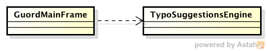

## Escuela Colombiana de Ingeniería

### Procesos de Desarrollo de Software 

## Laboratorio - Patrones Creacionales, Principios SOLID

__Trabajo individual o en parejas__

## Entregables:

**Jueves en clase**: Diseño de la nueva aplicación (diagrama de clases + diagrama de paquetes).

**Martes en clase**: Avance + dudas.

**Jueves a las 10:00am**: Ejercicio terminado.

***Instrucciones para Maven y GIT:*** Se requiere Linux.
* Para descargar la aplicación, desde una terminal, clone el repositorio, y luego abralo con NetBeans:

	```bash
	git clone https://github.com/PDSW-ECI/GoF-CreationalPatterns-FactoryMethod-Exercise.git
	```
* Para compilar, desde el directorio creado con el paso anterior:
	```bash
	mvn compile
	```
* Para ejecutar:
	```bash
	mvn exec:java  -Dexec.mainClass=edu.eci.arsw.wordprocessor.view.GuordMainFrame
	```


En este repositorio se encuentra una versión muy rudimentaria del editor de texto *Guord for dummies*. Este editor de texto, como su nombre lo indica, está orientado a personas inexpertas en el uso de tecnología, y cuenta como principal elemento el no requerir interactuar con un sistema de archivos (todos los documentos se guardan en una ruta estándar). Por ahora, sólo soporta el inglés.

Actualmente la aplicación hace uso del API de serialización de Java para hacer persistentes y reconstruir los documentos (en una ruta estándar desconocida por el usuario), y de la clase File para obtener el listado de los documentos creados en la misma (para cuando el usuario solicite abrir uno de los archivos).

Cuando el usuario tiene listo su documento, y al seleccionar la opción de guardar, la aplicación sólo le pregunta el nombre del documento, mas no en qué ruta lo guardará. La aplicación se encarga de mantener oculto este detalle, y simplemente, cuando el usuario selecciona la opción de ‘abrir’, ésta le muestra el listado de documentos previamente guardados.

Como todo buen editor de texto, esta herramienta busca integrar algunos recursos léxicos para asistir en la auto-corrección de errores tipográficos u ortográficos. Por ahora, la aplicación hace uso de la clase TypoCorrector, la cual contiene un conjunto local (integrado en la herramienta) de equivalencias de palabras.

El modelo de clases de la aplicación, por lo tanto, por ahora se reduce a:



__Ejercicio.__

Se le ha pedido que revise la aplicación y haga con la misma un ejericicio de ‘refactoring’, ya que ésta claramente no cumple con el metapatrón MVC (Modelo-Vista-Controlador), lo que dificultará en el futuro el mantenimiento de la misma. Por otro lado, se quiere que sea fácil mejorar y mantener ciertas características estratégicas de la herramienta. Para esto, en particular se le ha pedido:

* Rediseñar la aplicación de manera que en la misma se puedan identificar claramente las clases de presentación, lógica y persistencia. Utilice las [convenciones de Java para el nombramiento de paquetes](http://www.oracle.com/technetwork/java/codeconventions-135099.html) para que las clases correspondientes a cada capa queden en paquetes separados.

* Hacer los ajustes que hagan falta para que, además del mecanismo de persistencia mediante serialización, sea fácil incorporar nuevos mecanismos (en caso de que la serialización resulte obsoleta o ineficiente). Por ahora, se quere incorporar un esquema alternativo de persistencia basado en el almacenamiento del documento como texto plano.

* Hacer los ajustes que hagan falta para hacer fácil la adaptación de nuevos mecanismos de corrección automática de errores tipográficos/ortográficos. Por ahora se espera que se pueda elegir entre el existente (que hace uso de datos estáticos), y uno alternativo que haga uso de una base de datos -en línea- de errores tipográficos (los cuales son contínuamente actualizados): http://190.24.150.86/hcadavid/lang/eng_misspellings.txt . Para este último tenga en cuenta que es MUY importante la eficiencia de la implementación, ya que el programa hace una nueva consulta cada vez que se escribe una palabra. No se debería, por ejemplo, leer más de una vez el archivo con las equivalencias, y mantener las mismas en una estructura de datos que permita su consulta con una complejidad temporal promedio de O(1).
	
Con lo anterior, se quiere que la aplicación permita:

1. Agregarle mecanismos alternativos de persistencia de archivos SIN necesidad de modificar el _CORE_ de la aplicación.

2. Agregarle estrategias alternativas alternativas para la corrección de errores tipográficos SIN necesidad de modificar el _CORE_ de la aplicación.


### Proceso sugerido:

1. Proponga un nuevo diseño para la aplicación, donde se tengan clases que encapsulen las operaciones de la aplicación sujetas a eventuales cambios.
2. Aplique el principio de [Inversión de dependencias](https://dzone.com/articles/the-dependency-inversion-principle-dip-or-d-in-soi) en la manera de relacionar las clases identificadas anteriormente con el _CORE_ de la aplicación.
2. Con lo anterior, haga un diseño que adicionalmente considere el patrón [Método Fábrica](https://dzone.com/articles/design-patterns-factory) para el problema de la creación de las clases concretas. Tip: los productos concretos serán las clases identificadas en el paso 1.

3. Use como referencia [uno de los ejemplos de implementación disponibles](https://github.com/PDSW-ECI/GoF-FactoryMethod-ReferenceExample), en donde se plantea también el uso del patrón Singleton (para la creación de la fábrica concreta).


## Criterios de evaluación

1. Funcionalidad. La aplicación debe poderse configurar, sin tener que tocar el _CORE_ de la misma, para
	* Usar un formato de documento basado en objetos String serializadas, o uno basado en texto plano.

2. La solución debe quedar abierta para extensión y cerrada para modificación. Es decir, debe permitir (sólo configurando el esquema de fábricas):
	* Agregar nuevos esquemas de persistencia.
	* Agregar nuevas estrategias de corrección automática.
	
